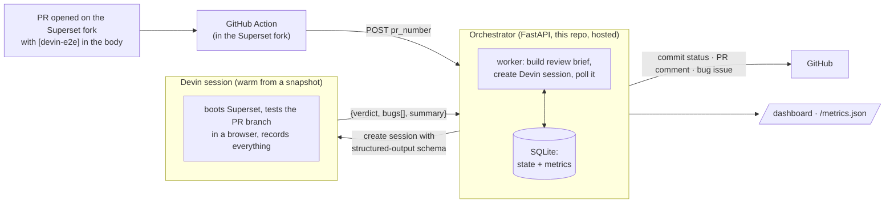

# Devin E2E Orchestrator

> A pull request opts in, Devin boots Superset, tests the behavior the PR claims like
> a human would, and reports back with evidence.
> Decisions and trade-offs live in [DECISIONS.md](./DECISIONS.md).

## The problem

QA on pull requests is expensive and easy to skip. Maintaining E2E tests costs more than
many changes justify, while manual verification depends on someone clicking through the
app. A PR can claim *"the modal now preserves the user's active status"* and ship
unverified. As more PR code is AI-generated, review volume rises while confidence in the
claims falls.

The answer is evidence before human review: a session reads the description, opens the
app, and tests the claimed behavior in a browser. **Devin is perfect for that job.** This
demo runs that loop against Apache Superset, a large real-world React frontend.

## The pipeline



Each step, concretely:

| Step | What happens | Where |
|---|---|---|
| Trigger | A PR on the Superset fork opts in with `[devin-e2e]` in the body (or the `devin-e2e-test` label) | `.github/workflows/devin-e2e-trigger.yml` in the fork |
| Forward | 30 lines of YAML `POST /reviews` with the PR number. No checkout, no secrets in the fork | same file |
| Dedupe | Review row keyed by PR + head SHA; a second trigger for the same commit while a review is running is refused *before* a session is created. A new push (new SHA) or a finished review can run again | `app/db.py`, `app/main.py` |
| Brief | The review brief — one markdown template in the repo, versioned in git with the code that parses its output — is filled with the PR title, body, branch, and SHA | `prompts/e2e_review.md` |
| Session | Devin's session-create API, with a JSON schema the session must answer in | `app/devin.py` |
| Test | Devin boots warm from a prebuilt snapshot, checks out the PR branch, logs in, tests with computer-use, screenshots + recording, and posts its evidence comment on the PR itself | Devin session |
| Verdict | `{verdict: pass \| bug_found \| error, bugs[], summary}` | `app/worker.py` |
| Write-back | Commit status `devin/e2e-review`, and on `bug_found` a linked bug issue — done in code, not by the agent, because these are invariants ([decision 5](./DECISIONS.md#5-structured-output-not-prose-parsing)) | `app/github.py` |
| Observe | State machine, durations, ACU cost in SQLite; `/dashboard` and `/metrics.json` | `app/db.py`, `app/main.py` |

The orchestrator polls the session every 60s (the Devin API has no completion webhook —
[decision 6](./DECISIONS.md#6-polling-not-callbacks)), caps parallel reviews at three, and
marks a review `timed_out` with a failing commit status after 90 minutes. Reviews still
active when the process restarts are marked `failed` rather than resumed, so a redeploy
can't double-spend a session.

## Proof it works

- [Superset PR #14](https://github.com/RichardHruby/superset/pull/14)
  - The body contains `[devin-e2e]`.
  - The GitHub Action fired.
  - Devin's [evidence comment](https://github.com/RichardHruby/superset/pull/14#issuecomment-5160016186)
    records the review, with screenshots of the bug.
  - The orchestrator auto-filed [issue #18](https://github.com/RichardHruby/superset/issues/18)
    and set a failing `devin/e2e-review` commit status.
  - Track runs yourself in the [deployed Render app](https://devin-e2e-tester.onrender.com/dashboard).

## Try it yourself — no credentials needed

1. Open a PR against [`RichardHruby/superset`](https://github.com/RichardHruby/superset)
   with `[devin-e2e]` in the body.
2. Use the pre-prepared examples in [`demo/REVIEWER_GUIDE.md`](demo/REVIEWER_GUIDE.md),
   or ask Devin (or any coding agent) to open one.

## Running it yourself

```bash
cp .env.example .env      # DEVIN_API_KEY, GITHUB_TOKEN, SUPERSET_REPO (a fork you can write to)
docker compose up -d
curl http://localhost:8000/healthz   # {"status":"ok"} before triggering anything
```

The first `docker compose up` creates `data/` and the SQLite database.

```bash
# ⚠️ This starts a real, billable Devin session against the PR you name.
curl -X POST localhost:8000/reviews \
  -H 'content-type: application/json' -d '{"pr_number": <PR_NUMBER>}'
```

`POST /reviews` is the single entrypoint — the GitHub Action calls the same endpoint. It
fetches the PR from GitHub, so it needs a valid `GITHUB_TOKEN`.

### Tester snapshot

Sessions boot from a prebuilt Devin snapshot of the Superset fork, built by a per-repo
blueprint: Node 24.16.0, frontend dependencies installed, and the prebuilt Superset backend
image pulled. A session starts the backend
(`docker compose -f docker-compose-image-tag.yml up -d superset`, ~45s to healthy on :8088),
checks out the PR branch, and runs the frontend dev server on :9000 with
`DISABLE_TS_CHECKER=true`. Demo credentials are `admin` / `admin`.

**Caveat:** the backend image is prebuilt, so only frontend changes run from the PR branch
— a deliberate demo simplification to cut scope. [Decision 8](./DECISIONS.md#8-a-blueprint-snapshot-not-per-session-setup)
covers what production would change.

## Environment

Three required, five optional:

| Variable | Purpose | Default |
|---|---|---|
| `DEVIN_API_KEY` | Devin API key (create/poll sessions) | — |
| `GITHUB_TOKEN` | GitHub API token (statuses, comments, issues) | — |
| `SUPERSET_REPO` | Repository under review | `RichardHruby/superset` |
| `REVIEWS_TOKEN` | Optional bearer token required by `POST /reviews` | unset (open) |
| `DEVIN_ORG_API_KEY` | Devin org service-user key, for ACU usage | unset |
| `DEVIN_ORG_ID` | Devin organization ID, for ACU usage | unset |
| `ACU_COST_USD` | Plan-dependent cost per ACU | `2.25` |
| `DATABASE_PATH` | SQLite file | `./data/reviews.db` |

Poll interval, review timeout, and the concurrency cap are code constants in
`app/worker.py` — nobody tunes those per deployment, so they aren't configuration. Cost
enrichment is wired to the Devin v3 consumption API and works for Enterprise orgs. This
self-serve demo org reports `0` ACUs, so the dashboard shows `n/a`; manual Usage-page
measurements put a full E2E review at about `$5`
([decision 7](./DECISIONS.md#7-metrics-an-em-would-use-to-decide-roll-out-vs-kill) covers
the metric picks).

## Where this goes

For every PR, production would create a preview deployment of the branch and a database
branch seeded with realistic synthetic data. Superset is Postgres, so the database branch
would let Devin E2E-test every meaningful feature under production-like conditions without
sharing state between reviews. When Devin finds a defect, it would push fix commits to the
same branch.

Coding agents make turning ideas into code cheap, but reviewing and verifying that code is
still expensive. This closes that gap: non-engineers and AI agents can contribute without
drowning the team in review, and hand-written E2E suites stop being the bottleneck.

## Repo map

```
app/main.py      FastAPI: POST /reviews, /dashboard, /metrics.json
app/worker.py    review lifecycle: session, poll, verdict, write-back
app/devin.py     Devin client + verdict parsing
app/github.py    comments, commit statuses, issues
app/db.py        SQLite state machine + aggregate metrics
prompts/         the E2E review brief, versioned in git
tests/           pytest suite (ruff + pytest in CI)
```
