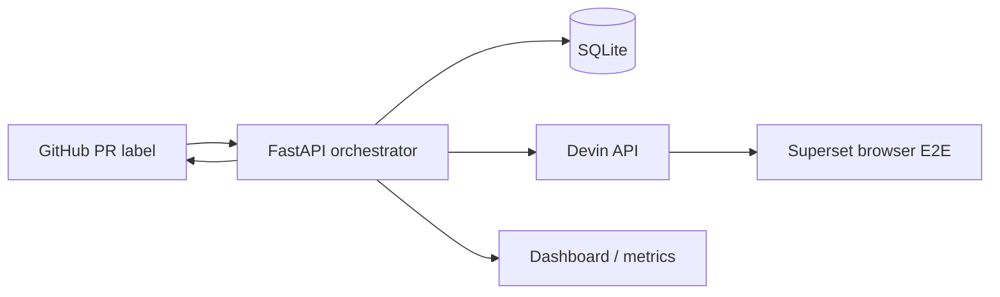

# Devin E2E Orchestrator

This service turns a labeled pull request into an autonomous, observable UI E2E
review: it renders a versioned test-plan prompt, starts a Devin session, polls
for a structured verdict, and reports the result back to GitHub.



## Quickstart

```bash
cp .env.example .env
# fill DEVIN_API_KEY, GITHUB_TOKEN, and webhook secret
docker compose up
curl -X POST localhost:8000/simulate \
  -H 'content-type: application/json' -d '{"pr_number":1}'
```

Configure a GitHub webhook on the fork/repository with URL
`https://your-host/webhook/github`, content type `application/json`, the same
secret as `GITHUB_WEBHOOK_SECRET`, and the Pull requests event enabled. The
service acts only on a `labeled` action where the added label matches
`REVIEW_LABEL`.

## Environment

| Variable | Purpose | Default |
|---|---|---|
| `DEVIN_API_KEY` | Devin v1 bearer key | — |
| `GITHUB_TOKEN` | GitHub API token | — |
| `GITHUB_WEBHOOK_SECRET` | HMAC webhook secret | unset (validation skipped) |
| `SUPERSET_REPO` | GitHub repository | `RichardHruby/superset` |
| `REVIEW_LABEL` | Trigger label | `devin-e2e-test` |
| `POLL_INTERVAL` | Devin poll seconds | `60` |
| `REVIEW_TIMEOUT_MINUTES` | Maximum review duration | `90` |
| `MAX_CONCURRENT_REVIEWS` | Maximum parallel Devin reviews | `3` |
| `DATABASE_PATH` | SQLite file | `./data/reviews.db` |

## How would I know this is working?

Open `/dashboard` for the live review table, state badges, Devin links, and
aggregate stats. `/metrics.json` exposes the same aggregate values for simple
monitoring. A successful trigger returns a review ID and `queued`; the worker
then posts a pending commit status and Devin session comment.

Reviews still active when the process restarts are marked `failed` on startup
instead of being resumed, avoiding duplicate Devin sessions. A terminal review
can be triggered again for the same PR head SHA; only active reviews are
idempotently blocked.
