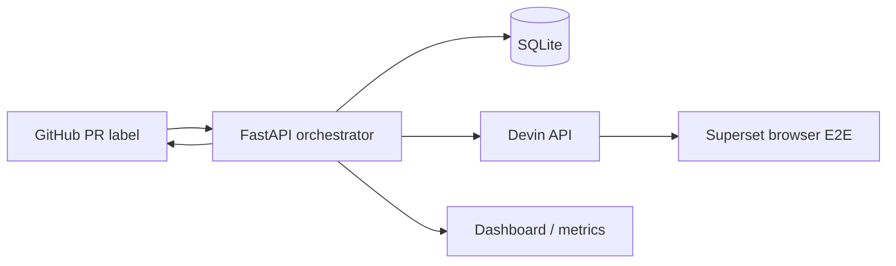

# Devin E2E Orchestrator

This service turns a marked or labeled pull request into an autonomous,
observable UI E2E review: it renders a versioned test-plan prompt, starts a
Devin session, polls for a structured verdict, and reports the result back to
GitHub.



## Quickstart

```bash
cp .env.example .env
# fill DEVIN_API_KEY, GITHUB_TOKEN, and webhook secret
docker compose up -d
curl http://localhost:8000/healthz
curl -X POST localhost:8000/simulate \
  -H 'content-type: application/json' -d '{"pr_number":1}'
```

The first `docker compose up` creates the local `data/` directory and SQLite
database automatically. The health check should return `{"status":"ok"}` before
triggering a review. The `/simulate` example requires a valid `GITHUB_TOKEN`
because it fetches the pull request from GitHub.

Configure a GitHub webhook on the fork/repository with URL
`https://your-host/webhook/github`, content type `application/json`, the same
secret as `GITHUB_WEBHOOK_SECRET`, and the Pull requests event enabled. The
The service acts on a `labeled` action where the added label matches
`REVIEW_LABEL`, or on an `opened`/`reopened` action whose body contains
`REVIEW_BODY_MARKER`.

## How a reviewer can try this

When a hosted orchestrator is configured, open a pull request against the
public fork [`RichardHruby/superset`](https://github.com/RichardHruby/superset)
with `[devin-e2e]` in the body. No repository permissions are needed for this
trigger path.

To run locally, configure your own `DEVIN_API_KEY` and `GITHUB_TOKEN`, set
`SUPERSET_REPO` to a fork you can access, and expose the local webhook endpoint
to GitHub. You can also trigger a review manually with `/simulate` using a
pull request number.

## Tester snapshot and blueprint

Tester sessions boot from a prebuilt Devin snapshot of the Superset fork. The
blueprint installs Node 24.16.0 and frontend dependencies, then pulls the
prebuilt backend images. A session starts the backend with:

```bash
docker compose -f docker-compose-image-tag.yml up -d superset
```

It checks out the PR branch and starts the local frontend development server
with `DISABLE_TS_CHECKER=true`. The demo credentials are `admin` / `admin`.
Production deployments should use pinned release images and staging
credentials stored in Devin organization secrets rather than demo credentials.

## Environment

| Variable | Purpose | Default |
|---|---|---|
| `DEVIN_API_KEY` | Devin v1 bearer key | — |
| `DEVIN_ORG_API_KEY` | Optional Devin organization API key for ACU usage | unset |
| `DEVIN_ORG_ID` | Optional Devin organization ID for ACU usage | unset |
| `ACU_COST_USD` | Organization-plan-dependent cost per ACU | `2.25` |
| `GITHUB_TOKEN` | GitHub API token | — |
| `GITHUB_WEBHOOK_SECRET` | HMAC webhook secret | unset (validation skipped) |
| `SUPERSET_REPO` | GitHub repository | `RichardHruby/superset` |
| `REVIEW_LABEL` | Trigger label | `devin-e2e-test` |
| `POLL_INTERVAL` | Devin poll seconds | `60` |
| `REVIEW_TIMEOUT_MINUTES` | Maximum review duration | `90` |
| `MAX_CONCURRENT_REVIEWS` | Maximum parallel Devin reviews | `3` |
| `REVIEW_BODY_MARKER` | Marker that triggers opened/reopened PR reviews | `[devin-e2e]` |
| `DATABASE_PATH` | SQLite file | `./data/reviews.db` |

## How would I know this is working?

Open `/dashboard` for the live review table, state badges, Devin links, filed
bug issues, and aggregate stats. `/metrics.json` exposes the same aggregate
values for simple monitoring. A successful trigger returns a review ID and
`queued`; the worker then posts a pending commit status and Devin session
comment. Bug findings are filed as GitHub issues and linked from the dashboard
and PR evidence comment.

ACU cost enrichment is enabled only when both `DEVIN_ORG_API_KEY` and
`DEVIN_ORG_ID` are set. The configured `ACU_COST_USD` value is an
organization-plan-dependent estimate.

There is no Devin session-completion webhook today, so the worker polls Devin
for structured verdicts. A prompt-driven callback could replace or reduce
polling in a future optimization.

Reviews still active when the process restarts are marked `failed` on startup
instead of being resumed, avoiding duplicate Devin sessions. A terminal review
can be triggered again for the same PR head SHA; only active reviews are
idempotently blocked.
