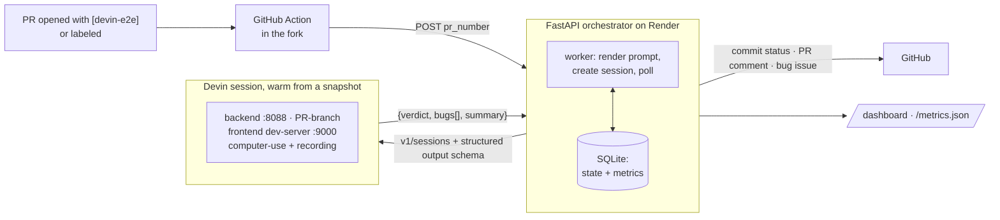

# Devin E2E Orchestrator

> A pull request opts in, Devin boots Superset, tests the behavior the PR claims like
> a human would, and reports back with evidence.
> Decisions and trade-offs live in [DECISIONS.md](./DECISIONS.md).

## The problem

UI changes in Apache Superset are expensive to E2E test. Writing and maintaining browser
tests for every PR costs more than most changes are worth, so in practice a PR description
says *"the modal now preserves the user's active status"* and nobody clicks through to
check. The claim ships unverified.

The gap isn't test infrastructure — it's that nobody reads the PR description, opens the
app, and tries the thing. That is a task, not a test suite. So: **a PR opts in, an
autonomous session boots the app, tests the claimed behavior in a browser, and posts a
verdict with screenshots and a recording.** The PR author gets a commit status; a human
still judges the evidence.

## The pipeline



Each step, concretely:

| Step | What happens | Where |
|---|---|---|
| Trigger | PR opened with `[devin-e2e]` in the body, or labeled `devin-e2e-test` | `.github/workflows/devin-e2e-trigger.yml` in the fork |
| Forward | 30 lines of YAML POST the PR number to the orchestrator. No checkout, no secrets in the fork | same file |
| Dedupe | Review row keyed by PR + head SHA; an active review for the same SHA is refused *before* a session is created | `app/db.py`, `app/main.py` |
| Prompt | Versioned template rendered with PR title, body, branch, SHA | `prompts/e2e_review.md` |
| Session | `POST /v1/sessions` with a structured-output JSON schema | `app/devin.py` |
| Test | Devin boots warm from a prebuilt snapshot, checks out the PR branch, logs in, tests with computer-use, screenshots + recording | Devin session |
| Verdict | `{verdict: pass \| bug_found \| error, bugs[], summary}` | `app/worker.py` |
| Write-back | Commit status `devin/e2e-review`, PR comment, and on `bug_found` a linked bug issue | `app/github.py` |
| Observe | State machine, durations, ACU cost in SQLite; `/dashboard` and `/metrics.json` | `app/db.py`, `app/main.py` |

The orchestrator polls the session every 60s (the Devin API has no completion webhook —
[decision 6](./DECISIONS.md#6-polling-not-callbacks)), caps parallel reviews at
`MAX_CONCURRENT_REVIEWS`, and marks a review `timed_out` with a failing commit status past
`REVIEW_TIMEOUT_MINUTES`. Reviews still active when the process restarts are marked
`failed` rather than resumed, so a redeploy can't double-spend a session.

## Proof it works

- **Devin found a planted bug.** [superset#2](https://github.com/RichardHruby/superset/pull/2) claims
  it clarifies the active-status field in the user modal. `UserListModal.tsx:117` actually
  reads `active: isEditMode ? !user?.active : true` — editing any user silently flips their
  active status and locks them out. Devin caught it in the browser, with repro steps,
  screenshots, and a recording on the PR. No test in the repo would have.
- **A fully public, zero-touch run.**
  [superset#5](https://github.com/RichardHruby/superset/pull/5) was opened with `[devin-e2e]`
  in the body. The Action fired, Render created the session, Devin found the bug, the
  orchestrator auto-filed [issue #6](https://github.com/RichardHruby/superset/issues/6) and
  set a failing commit status. Nothing was clicked in between.
- **Live:** [devin-e2e-tester.onrender.com/dashboard](https://devin-e2e-tester.onrender.com/dashboard)
  (`/metrics.json` for the same numbers as JSON).

## Try it yourself — no credentials needed

Open a PR against [`RichardHruby/superset`](https://github.com/RichardHruby/superset) with
`[devin-e2e]` anywhere in the body. Then watch, in order: the Action run, the *"review
started"* comment with the session link, the verdict comment with evidence, the
`devin/e2e-review` commit status, and a new row on the dashboard. A frontend change with a
description that claims something specific gives Devin the most to work with.

Fastest path: [`demo/REVIEWER_GUIDE.md`](demo/REVIEWER_GUIDE.md) — three branches are already
pushed to the fork with ready-to-paste titles and bodies, so triggering a review is a compare
link plus a paste.

The body marker is a permissionless opt-in — GitHub only lets users with triage access add
labels, so external contributors can't use the label path
([decision 2](./DECISIONS.md#2-the-devin-e2e-body-marker-instead-of-a-label)).

## Running it yourself

```bash
cp .env.example .env      # DEVIN_API_KEY, GITHUB_TOKEN, SUPERSET_REPO (a fork you can write to)
docker compose up -d
curl http://localhost:8000/healthz   # {"status":"ok"} before triggering anything
```

The first `docker compose up` creates `data/` and the SQLite database.

```bash
# ⚠️ This starts a real, billable Devin session against the PR you name.
curl -X POST localhost:8000/simulate \
  -H 'content-type: application/json' -d '{"pr_number": <PR_NUMBER>}'
```

`/simulate` is the manual trigger and the same entrypoint the GitHub Action uses; it fetches
the PR from GitHub, so it needs a valid `GITHUB_TOKEN`. For the raw-webhook path instead,
point a GitHub webhook at `https://your-host/webhook/github` (`application/json`, Pull
requests event, secret matching `GITHUB_WEBHOOK_SECRET` — the HMAC is verified).

### Tester snapshot

Sessions boot from a prebuilt Devin snapshot of the Superset fork, built by a per-repo
blueprint: Node 24.16.0, frontend dependencies installed, and the prebuilt Superset backend
image pulled. A session starts the backend
(`docker compose -f docker-compose-image-tag.yml up -d superset`, ~45s to healthy on :8088),
checks out the PR branch, and runs the frontend dev server on :9000 with
`DISABLE_TS_CHECKER=true`. Demo credentials are `admin` / `admin`.

**Caveat:** the backend image is prebuilt, so backend changes in a PR are not exercised —
only the frontend runs from the PR branch. [Decision 8](./DECISIONS.md#8-a-blueprint-snapshot-not-per-session-setup)
covers what production would change.

## Environment

| Variable | Purpose | Default |
|---|---|---|
| `DEVIN_API_KEY` | Devin v1 bearer key | — |
| `GITHUB_TOKEN` | GitHub API token (comments, statuses, issues) | — |
| `SUPERSET_REPO` | Repository under review | `RichardHruby/superset` |
| `GITHUB_WEBHOOK_SECRET` | HMAC secret for `/webhook/github` | unset (validation skipped) |
| `SIMULATE_TOKEN` | Optional bearer token required by `/simulate` | unset (open) |
| `REVIEW_LABEL` | Trigger label | `devin-e2e-test` |
| `REVIEW_BODY_MARKER` | Marker triggering review on opened/reopened PRs | `[devin-e2e]` |
| `POLL_INTERVAL` | Devin poll seconds | `60` |
| `REVIEW_TIMEOUT_MINUTES` | Maximum review duration | `90` |
| `MAX_CONCURRENT_REVIEWS` | Parallel Devin reviews | `3` |
| `DEVIN_ORG_API_KEY` | Devin v3 org key, for ACU usage | unset |
| `DEVIN_ORG_ID` | Devin organization ID, for ACU usage | unset |
| `ACU_COST_USD` | Plan-dependent cost per ACU | `2.25` |
| `DATABASE_PATH` | SQLite file | `./data/reviews.db` |

Cost enrichment runs only when both `DEVIN_ORG_API_KEY` and `DEVIN_ORG_ID` are set; until
billing data exists the dashboard shows `n/a` rather than a fake `$0.00`.

## How I'd know this is working

`/dashboard` (a table plus five cards, refreshing every 15s) and `/metrics.json` answer the
question an engineering manager piloting this would actually ask — is this worth keeping?
Reviews run, bugs caught pre-merge with one-click links to the issue and evidence, cost per
review in dollars, average time to verdict, and how many reviews are in flight.
[Decision 7](./DECISIONS.md#7-metrics-an-em-would-use-to-decide-roll-out-vs-kill) explains
the picks, including what I deliberately left off.

## Repo map

```
app/main.py      FastAPI: webhook, /simulate, /dashboard, /metrics.json
app/worker.py    review lifecycle: session, poll, verdict, write-back
app/devin.py     Devin client + verdict parsing
app/github.py    comments, commit statuses, issues, HMAC verification
app/db.py        SQLite state machine + aggregate metrics
prompts/         versioned E2E review brief
tests/           pytest suite (ruff + pytest in CI)
```
