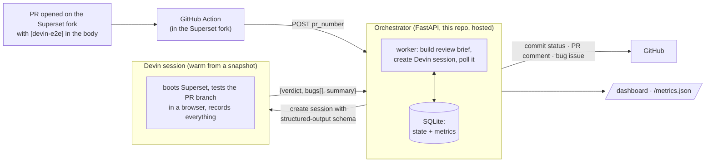

# Devin E2E Orchestrator

> A pull request opts in, Devin boots Superset, tests the behavior the PR claims like
> a human would, and reports back with evidence.
> Decisions and trade-offs live in [DECISIONS.md](./DECISIONS.md).

## The problem

QA on pull requests is expensive and error-prone. Writing and maintaining E2E tests costs
more than most changes are worth, and manual verification means a human clicking through
the app — so in practice a PR description says *"the modal now preserves the user's active
status"* and nobody checks. The claim ships unverified. And as more PR code is
AI-generated, review volume goes up while the author's own confidence in the claims goes
down — exactly the wrong direction for "trust the description".

The fix isn't more test infrastructure — it's that before a human reviews a PR, there
should already be evidence that *someone* read the description, opened the app, and tried
the thing. That someone doesn't have to be human. So: **a PR opts in, an autonomous
session boots the app, tests the claimed behavior in a browser, and posts a verdict with
screenshots and a recording.** The PR author gets a commit status; the human reviewer
starts from evidence instead of trust. This demo runs it against Apache Superset, a large
real-world React frontend.

## The pipeline



Each step, concretely:

| Step | What happens | Where |
|---|---|---|
| Trigger | A PR on the Superset fork opts in with `[devin-e2e]` in the body (or the `devin-e2e-test` label) | `.github/workflows/devin-e2e-trigger.yml` in the fork |
| Forward | 30 lines of YAML `POST /reviews` with the PR number. No checkout, no secrets in the fork | same file |
| Dedupe | Review row keyed by PR + head SHA; a second trigger for the same commit while a review is running is refused *before* a session is created. A new push (new SHA) or a finished review can run again | `app/db.py`, `app/main.py` |
| Brief | The review brief — one markdown template in the repo, versioned in git with the code that parses its output — is filled with the PR title, body, branch, and SHA | `prompts/e2e_review.md` |
| Session | Devin's session-create API, with a JSON schema the session must answer in | `app/devin.py` |
| Test | Devin boots warm from a prebuilt snapshot, checks out the PR branch, logs in, tests with computer-use, screenshots + recording, and posts its evidence comment on the PR itself | Devin session |
| Verdict | `{verdict: pass \| bug_found \| error, bugs[], summary}` | `app/worker.py` |
| Write-back | Commit status `devin/e2e-review`, and on `bug_found` a linked bug issue — done in code, not by the agent, because these are invariants ([decision 5](./DECISIONS.md#5-structured-output-not-prose-parsing)) | `app/github.py` |
| Observe | State machine, durations, ACU cost in SQLite; `/dashboard` and `/metrics.json` | `app/db.py`, `app/main.py` |

The orchestrator polls the session every 60s (the Devin API has no completion webhook —
[decision 6](./DECISIONS.md#6-polling-not-callbacks)), caps parallel reviews at three, and
marks a review `timed_out` with a failing commit status after 90 minutes. Reviews still
active when the process restarts are marked `failed` rather than resumed, so a redeploy
can't double-spend a session.

## Proof it works

[superset#5](https://github.com/RichardHruby/superset/pull/5) was opened with `[devin-e2e]`
in the body — a frontend change whose description claims editing a user preserves their
active status, while the code silently flips it. The Action fired, the hosted orchestrator
created the session, Devin found the bug in the browser (repro steps, screenshots, and a
recording on the PR), the orchestrator auto-filed
[issue #6](https://github.com/RichardHruby/superset/issues/6) and set a failing commit
status. Nothing was clicked in between. The run shows up on the live dashboard:
[devin-e2e-tester.onrender.com/dashboard](https://devin-e2e-tester.onrender.com/dashboard)
(`/metrics.json` for the same numbers as JSON).

## Try it yourself — no credentials needed

Open a PR against [`RichardHruby/superset`](https://github.com/RichardHruby/superset) with
`[devin-e2e]` anywhere in the body. Then watch, in order: the Action run, the *"review
started"* comment with the session link, the verdict comment with evidence, the
`devin/e2e-review` commit status, and a new row on the dashboard. A frontend change with a
description that claims something specific gives Devin the most to work with.

Fastest path: [`demo/REVIEWER_GUIDE.md`](demo/REVIEWER_GUIDE.md) — three branches are already
pushed to the fork with ready-to-paste titles and bodies, so triggering a review is a compare
link plus a paste.

The body marker is a permissionless opt-in — GitHub only lets users with triage access add
labels, so external contributors can't use the label path
([decision 2](./DECISIONS.md#2-the-devin-e2e-body-marker-instead-of-a-label)).

## Running it yourself

```bash
cp .env.example .env      # DEVIN_API_KEY, GITHUB_TOKEN, SUPERSET_REPO (a fork you can write to)
docker compose up -d
curl http://localhost:8000/healthz   # {"status":"ok"} before triggering anything
```

The first `docker compose up` creates `data/` and the SQLite database.

```bash
# ⚠️ This starts a real, billable Devin session against the PR you name.
curl -X POST localhost:8000/reviews \
  -H 'content-type: application/json' -d '{"pr_number": <PR_NUMBER>}'
```

`POST /reviews` is the single entrypoint — the GitHub Action calls the same endpoint. It
fetches the PR from GitHub, so it needs a valid `GITHUB_TOKEN`. An earlier version also had
a raw GitHub-webhook receiver with HMAC verification; it was cut because two entry paths
for one demo is one too many ([decision 1](./DECISIONS.md#1-the-trigger-is-a-github-action-forwarder-not-a-raw-webhook)).

### Tester snapshot

Sessions boot from a prebuilt Devin snapshot of the Superset fork, built by a per-repo
blueprint: Node 24.16.0, frontend dependencies installed, and the prebuilt Superset backend
image pulled. A session starts the backend
(`docker compose -f docker-compose-image-tag.yml up -d superset`, ~45s to healthy on :8088),
checks out the PR branch, and runs the frontend dev server on :9000 with
`DISABLE_TS_CHECKER=true`. Demo credentials are `admin` / `admin`.

**Caveat:** the backend image is prebuilt, so backend changes in a PR are not exercised —
only the frontend runs from the PR branch. [Decision 8](./DECISIONS.md#8-a-blueprint-snapshot-not-per-session-setup)
covers what production would change.

## Environment

Three required, five optional:

| Variable | Purpose | Default |
|---|---|---|
| `DEVIN_API_KEY` | Devin API key (create/poll sessions) | — |
| `GITHUB_TOKEN` | GitHub API token (statuses, comments, issues) | — |
| `SUPERSET_REPO` | Repository under review | `RichardHruby/superset` |
| `REVIEWS_TOKEN` | Optional bearer token required by `POST /reviews` | unset (open) |
| `DEVIN_ORG_API_KEY` | Devin org service-user key, for ACU usage | unset |
| `DEVIN_ORG_ID` | Devin organization ID, for ACU usage | unset |
| `ACU_COST_USD` | Plan-dependent cost per ACU | `2.25` |
| `DATABASE_PATH` | SQLite file | `./data/reviews.db` |

Poll interval, review timeout, and the concurrency cap are code constants in
`app/worker.py` — nobody tunes those per deployment, so they aren't configuration. Cost
enrichment runs only when both org variables are set; until billing data exists the
dashboard shows `n/a` rather than a fake `$0.00`
([decision 7](./DECISIONS.md#7-metrics-an-em-would-use-to-decide-roll-out-vs-kill) covers
the metric picks).

## Where this goes

The demo is deliberately opt-in and frontend-only. The extensions I'd build next, roughly
in order:

- **Agentic CI, not opt-in**: drop the marker and fire on every PR touching
  `superset-frontend/**` (the `paths` filter is already written, commented, in the
  workflow), and let the `devin/e2e-review` status gate merges next to unit tests.
- **Every feature, not just frontend**: build a backend image from the PR when backend
  code changes, give each review a database branch (Neon-style copy-on-write) so
  migrations and data changes are exercised against real data safely, and point the
  session at a per-PR preview deployment instead of a locally booted app — then the thing
  being tested is the thing that ships.
- **Close the loop**: on `bug_found`, spawn a follow-up session that opens a fix PR
  against the branch, turning the reviewer into a remediator.
- **Cheaper verdicts**: have the session POST its verdict back as its final act, keeping
  polling only as the crash fallback ([decision 6](./DECISIONS.md#6-polling-not-callbacks)).

## Repo map

```
app/main.py      FastAPI: POST /reviews, /dashboard, /metrics.json
app/worker.py    review lifecycle: session, poll, verdict, write-back
app/devin.py     Devin client + verdict parsing
app/github.py    comments, commit statuses, issues
app/db.py        SQLite state machine + aggregate metrics
prompts/         the E2E review brief, versioned in git
tests/           pytest suite (ruff + pytest in CI)
```
